# 使用说明书

**本软件可对视频进行抽帧筛选，然后可将抽帧筛选的图片，自动进行打标和二次筛选。所以，主要的操作是将视频上传，抽帧，将抽帧后的图片进行筛选打标，再根据抽帧打标的图片进行筛选和统计数据。下面在功能介绍部分，会按照抽帧，自动打标，筛选的顺序来进行介绍。**
----
## 在操作之前首先要把电脑对应的环境配置好
>（在操作连接服务器已经下载了vscode同时也下载了python和remote explorer插件）（在python配置好后可通过cmd指令打开命令行，然后依次粘上下面```pip install```的命令，下载安装对应配置，下载情况类似下图）
```
pip install ultralytics  #安装依赖，执行anotator.py前需参考 2.1.1 修改utils配置的路径
pip install git+https://github.com/openai/CLIP.git
pip install imagehash
```
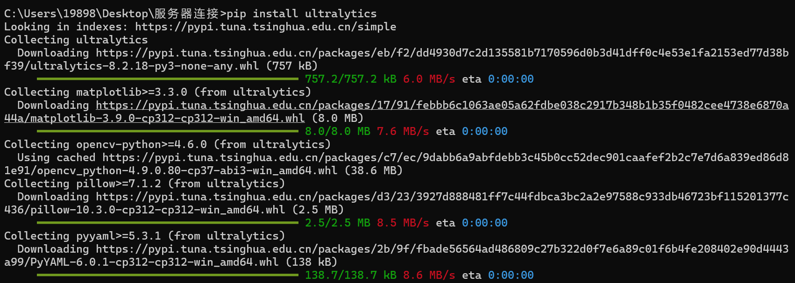

## 环境配置好后就可以开始操作了，首先进入服务器
---打开vscode
 1. 通过remote explorer进入服务器
 ----

----
## 刚进入服务器时，左边只有对应名字的空文件夹，用scp命令把mumu-data-engine-xm_data文件夹上传，之后可看到咱们操作的工程项目内容。

```scp -r 数据存储地址 star@Serever-105:目标地址 ```
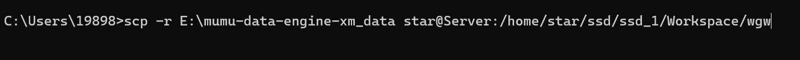
----
在进入服务器工程文件之后可以看到的左边文件夹结构。
（点开对应选项可以看到如下的结构，对照着没问题即可）
（下面每个选项卡对应的是各个功能选项，data为存储文件，是存储需要处理视频的地方，里面内容会有不同，在后面操作中需要再设置。）

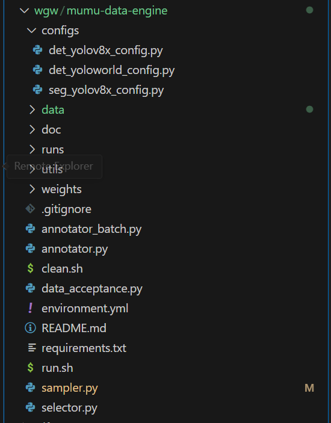
```bash
   .
   ├── configs
   │   ├── det_yolov8x_config.py
   │   ├── det_yoloworld_config.py
   │   └── seg_yolov8x_config.py
   ├── data
   │   ├── cattle
   │   ├── pig
   │   └── sheep
   ├── README.md
   ├── runs
   │   ├── detect
   │   ├── readme.md
   │   └── segment
   ├── sampler.py
   ├── annotator.py
   ├── selector.py
   ├── utils
   │   ├── archive
   │   ├── frames_sampler.py
   │   ├── hevc2avc.sh
   │   ├── __pycache__
   │   ├── rm_rect.py
   │   ├── sampler.sh
   │   ├── ultralytics_setting.py
   │   └── utils.py
   └── weights
      ├── checkpoints
      │     ├── mumu_det_yolov8x_0418.pt # 命名方式：mumu_任务_模型底座_日期
      │     └── mumu_seg_yolov8x_0418.pt      
      └── pretrained
            ├── sam_h.pt
            └── yolov8x-worldv2.pt
```
2. 激活环境

在下面终端部分输入下面内容激活data engine回车运行，并进入mumu-data-engine文件（新出现的括号里从base变为mumu-data-engine即激活成功）（蓝色文字以进入mumu-data-engine为止）
```
conda activate mumu-data-engine
cd +对应位置
```
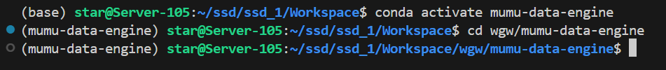
------
## 数据上传

1. 把左边的文件夹设置成如下格式，鼠标右键new folder可以创建新文件夹。(主要是改data的文件夹)

（导入的视频需要进行抽帧处理，抽帧操作会在cam文件下进行，所以data文件夹下的文件夹按照如下设置）
（cam是摄像头缩写，后面接时间）

```bash
├── mumu-data-engine
│   ├── data  
│   │   ├── cattle
│   │   │   ├── Raw
│   │   │   │   └── CAM1
│   │   │   │       └── 2023-07-25
```
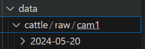


2. 上传视频，可以直接把自己电脑内的视频拖拽进文件夹内，也可以通过

```scp -r 数据存储地址 star@Serever-105:目标地址 ```

服务器内的目标地址可以如下图这样复制


回车运行，下图为正在上传图片，上传完成时，即可在目标地址内看到上传的视频。

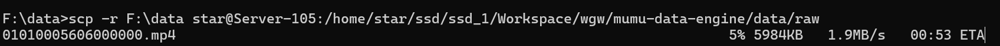

传输完成后，可在服务器对应位置看到视频

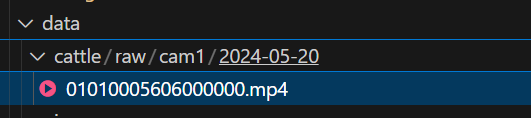

## 处理数据

### 在处理数据前，可以先了解下之后会出现的一些词的意思，方便后面操作时对应。（描述是意思，默认值是在之后操作中和系统中默认的设定情况）

 ```bash
--dimensions  
   - 默认值：[1920, 1080]
   - 描述：视频的尺寸，以像素为单位。

--fps  
   - 默认值：15
   - 描述：每秒帧数（FPS）。

--input_dir  
   - 默认值：`data/vid_raw/CAM0`
   - 描述：图像的输入目录。

--dates  
   - 默认值：空列表
   - 描述：要处理的特定日期列表。日期的格式应为`YYYY-MM-DD`，如果为空，则处理所有日期。

--sampling_rules  
   - 默认值：["10-1-1"]
   - 描述：采样率。比如：10-1-1 每10秒采样1秒，每秒取1帧（默认）

--roi  
   - 默认值：是（后面有对应操作，之后的界面更能清楚的反应这个感兴趣是什么）
   - 描述：是否启用感兴趣区域（ROI）选择以用于pHash过滤。

--save_roi_img
   - 默认值：是
   - 描述：是否保存填充的掩模图像以供注释。

--compress  
   - 默认值：否
   - 描述：是否将图像文件夹压缩为zip文件。

--phash 
   - 默认值：否（图片相似度识别，可以用来排除相似的图片）
   - 描述：是否启用pHash过滤。

 --phash_threshold  
    - 默认值：3（可以理解为排除相似度时我需要排除的程度）
    - 描述：pHash比较的相似性阈值。

--log  
    - 默认值：是（vlog里的log，日志，记录数据的）
    - 描述：是否启用帧选择的日志记录。

--max_workers  
    - 默认值：48
    - 描述：多进程处理的工作线程数。
```


# 运行操作（下面会按照抽帧，自动打标，筛选三步来进行讲解）


### 1. sampler抽帧操作 `sampler.py`

   1. 把下面的指令直接复制在命令行输入的地方，dir之后到--sampling之前的部分为你视频所在的地址位置，这里选择复制到cam一级的地址（这个地址包含视频，且在之后抽帧生成的标准图片也会在cam级下生成）可以直接在左边cam那里右键选择copy path 复制它的位置，粘在dir到--sampling之间，替换掉下面例子中的位置。（下图这里把ph筛选关掉了，有需要可根据需要打开，指令为开的状态，且设置为3级）
   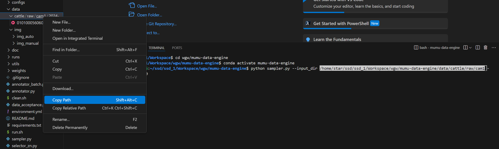
   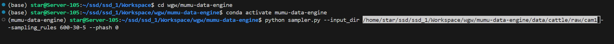
   ```
   python sampler.py --input_dir data/cattle/Raw/c1 --sampling_rules 600-30-5 --phash 1 --phash_threshold 3
   ```
   2. 可以设置，多少秒抽几秒，在sampling_rules 后面数字那里更改
   3. ph是筛除重复，提升效率用，可以不开，设置ph为0，使数据抽帧更均匀直观，也可以根据自己的需要保留。
   4. 命令输入后回车运行，会在左边的文件夹内出现抽帧后的标准图片，并弹出下面的内容：（这一步的操作是为了给抽帧的图片加上感兴趣区域，可以更精准的定位图片中的内容，即roi区域。）

   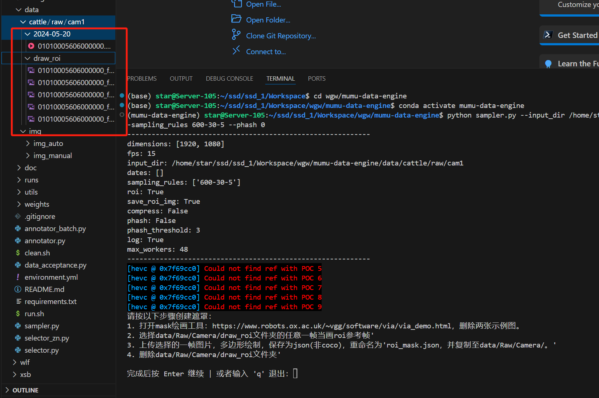

------------------------------------------------------------
>请按以下步骤创建遮罩：
>1. 打开mask绘画工具：https://www.robots.ox.ac.uk/~vgg/software/via/via_demo.html，删除两张示例图。
>2. 选择data/Raw/Camera/draw_roi文件夹的任意一帧当画roi参考帧'
>3. 上传选择的一帧图片，多边形绘制，保存为json(非coco)，重命名为'roi_mask.json，并复制至data/Raw/Camera/。'
>4. 删除data/Raw/Camera/draw_roi文件夹。'
> 完成后按 Enter 继续 | 或者输入 'q' 退出：

对应的具体的操作如下：

>   1. 首先把上图左边红框中处理后的图片选一张下载到自己的电脑上（鼠标在对应的图片上右键download，选择存储的位置）

>   2. 把步骤中的网址复制粘贴在浏览器中打开，也可以按住ctrl点击步骤中的网页，选择打开，直接跳转浏览器界面，下图为跳转后的页面，先删除红框中的示例图（点击下方remove删除，弹出界面选ok）：
   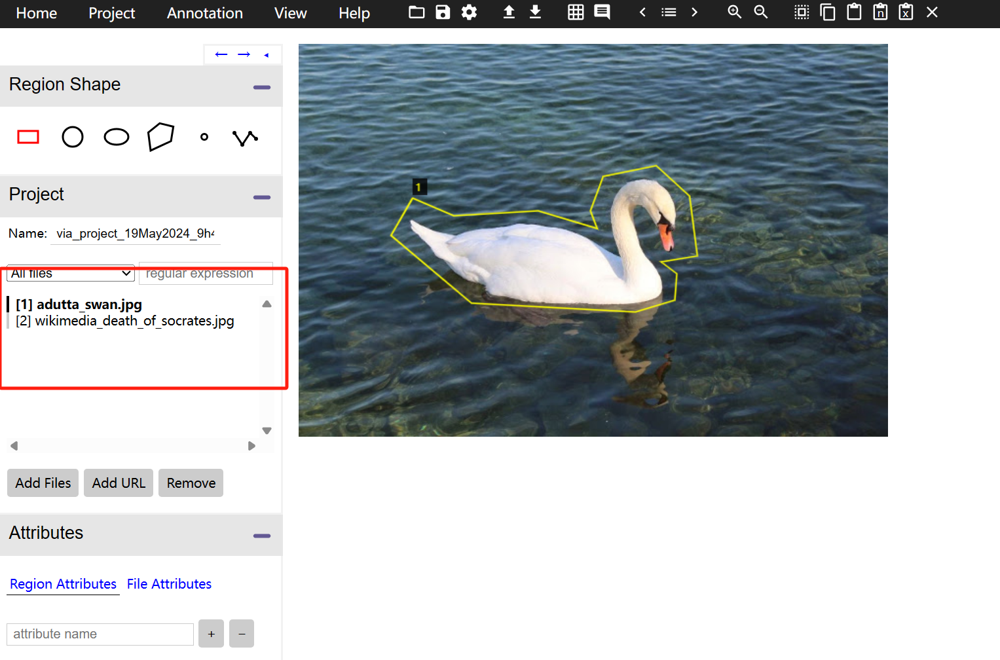

>   3. 把刚才存下的图片通过add按钮添加，并选取多边形进行画框选取感兴趣区域：
     


>   4. 圈取后，把图片存成json格式：
     
  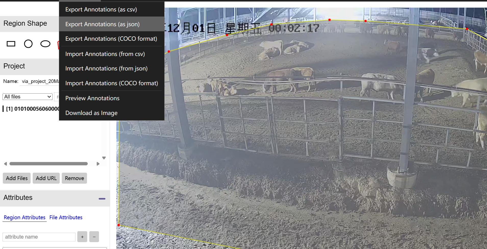

>   5. 存好后，需要再去图片存储的区域，更改下图片的名字，将其改为roi_mask.json
     
5. 把改好名字的图片导入服务器中data/Raw/Cam/文件夹内（cam为设置的摄像头层级）（直接从文件夹拖进去就可以）
     
  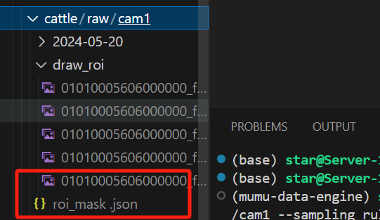 
  
6. 存好图片后，点回终端界面，鼠标回到退出：后，按回车运行。
  
  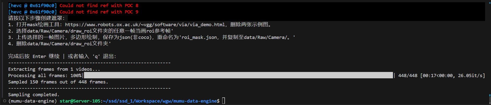

**抽帧操作后输出的结果**
---
抽帧操作后，左边会对应生成下面的文件并存储抽帧后的图片：

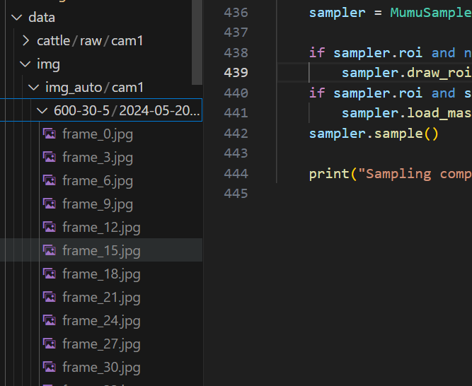

同时可在列表中看到以下文件，分别代表：

>roi_mask.json：是用来将非感兴趣区域涂黑，缩小范围，便于标注

>img_auto：用于模型训练

>img_manual：用于最终得到精标的数据

>frame_selection_chart.png

其中，chart文件如下所示：

该图表是用来展示帧采样情况的，具体含义如下：
- **蓝色竖线（Sampled Color）**：表示被采样选中的帧，在视频处理过程中被保留的帧。
- **橙色竖线（Failed Color）：**：表示未被采样选中的帧，在视频处理过程中被丢弃的帧。
- **横坐标（X轴）**：代表视频中的帧索引，从左到右依次增加。
- **纵坐标（Y轴）**：没有具体数值，仅作为参考线存在。
- **标题**：标题显示了该图表所针对的摄像头名称和视频文件名称。
- **X轴标签**：标签为“Frame Index”，表示横坐标表示的是帧的索引
####  sampling_log.txt
左边生成的log.txt文件是数据处理后生成的日志文件，可以理解为数据总结，有刚才操作所对应的参数：
```bash
--Camera: 是指对应的摄像头        
--VideoFile:  是指对应视频的存储位置
--VideoDuration: 视频时长
--FPS： 每秒帧数
--TotalFrames： 总帧数
--FailedFrames: 失败帧数
--SampledFrames: 采样帧数
--SampledPercentage： 采样比例
--SamplingRule： 采样规则
--ROIFiltering： 是否采取roi遮罩
--PHashFiltering： 是否采取ph筛选
--PHashThreshold： pu筛选阈值
--SampledFramesIndices： 采样帧索引
--FailedFramesIndices： 失败帧索引
```
日志示例：
```
Camera: c2
Video File: /home/star/ssd/ssd_2/mumu-data-engine/data/cattle/Raw/c2/2023-12-18/01000000151000000.mp4
Video Duration: 104.60 minutes
FPS: 15
Total Frames: 94143
Failed Frames: 0
Sampled Frames: 13
Sampled Percentage: 0.01%
Sampling Rule: 10-1-1
ROI Filtering: True
PHash Filtering: True
PHash Threshold: 3
Sampled Frames Indices: [0, 7350, 17250, 73050, 74250, 79950, 81600, 81900, 84600, 88200, 90900, 93000, 93450]
Failed Frames Indices: []
```

### 2.自动打标 `annotator.py`
----
通过加载模型和推理图片后，进行对象的检测和分割，从而得到粗标签，支持语义分割（标签）和区域感兴趣（ROI）处理.

具体操作：
1. 首先进行utils配置 (`utils/ultralytics_setting.py`)
这里需要把utils的对应位置更改成你的位置，
把data的地址， weights/pretrained的地址 和 runs的地址，复制下来和settings里的对应内容进行更换。
（同样右键对应项可以选择copy path来复制地址进行替换。）

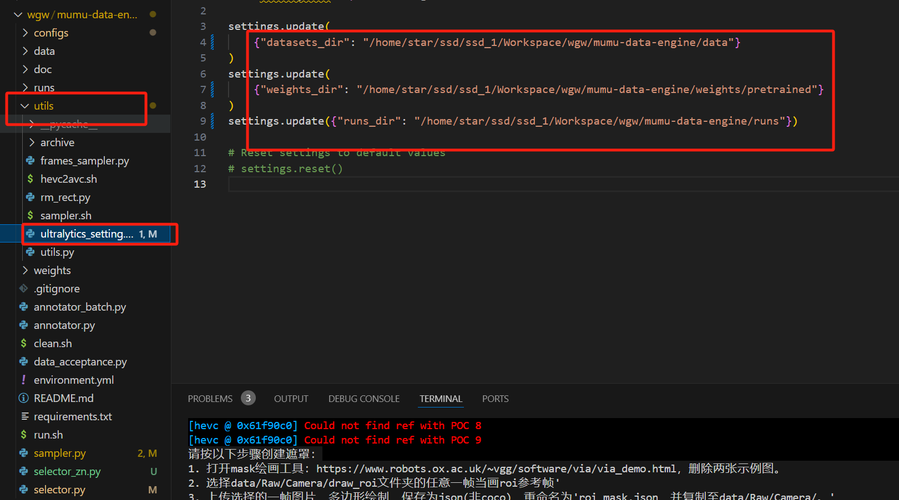
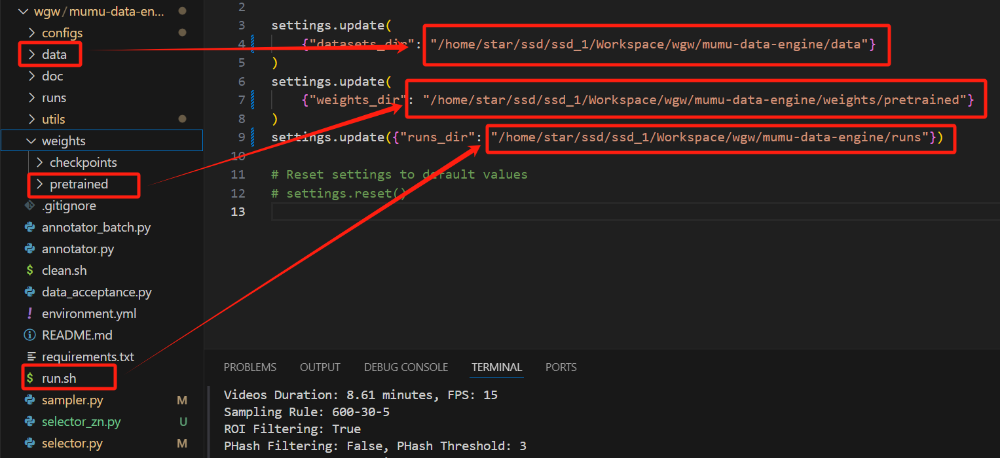
----
2. 模型位置配置，一共有3种模型配置，分别对应不同的使用场景：
   - **YOLOv8x** (`config/det_yolov8x_config.py`)：适用于通用对象检测和分割，其中分割基于检测框做分割
   - **YOLOWorld** (`config/det_yoloworld_config.py`)：特化于特定类别（如牲畜）的检测，可以通过覆写类别实现更精确的模型适应性。
   - **YOLOv8x_seg** (`config/seg_yolov8x_config.py`)：适用于通用对象分割
----
目前主要使用YOLOWorld，另两个还再调试升级

在config下点开yoloworld，在右边weight_path处更换地址。

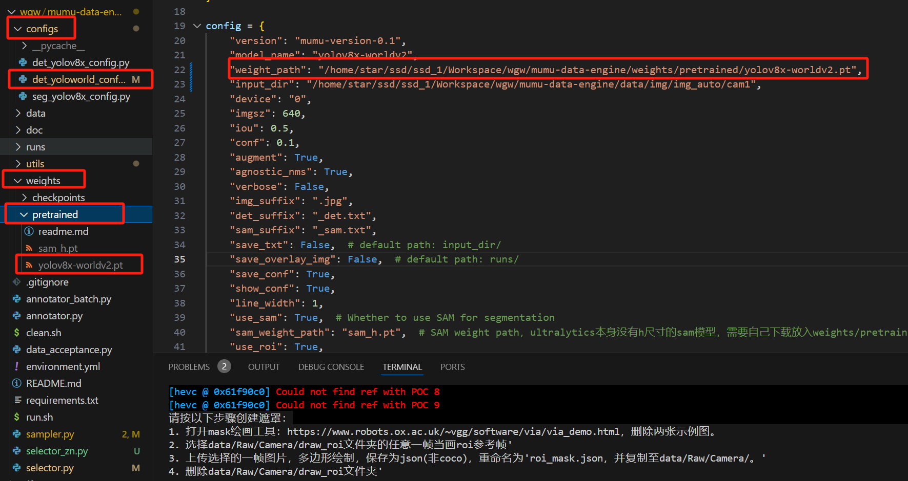

3. 运行粗标模型进行粗标操作
运行的代码如下：

（同样dir之后为需要更改的位置）
运行下面的代码，把dir之后的位置进行替换后回车运行。
```bash
python annotator.py yoloworld --animal cattle --input_dir /home/star/ssd/ssd_2/mumu-data-engine/data/cattle/imgs/img_auto/c1
```
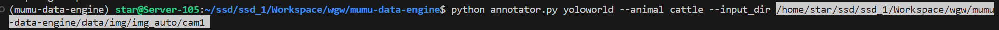

4. 运行结果：
左边img文件夹下会出现对应粗标的结果。

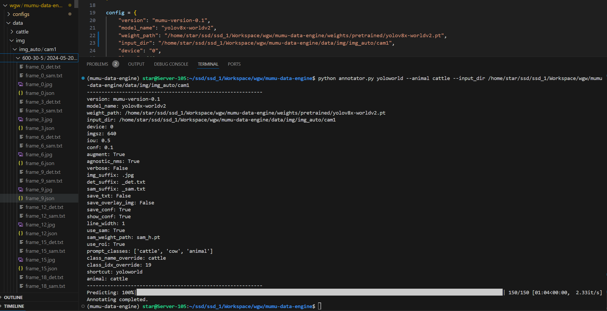

会新出现两个标注文本，格式如下：
<image_path>_det.txt 和 <image_path>_sam.txt，这里面包含了边界框和分割的信息。
```bash
19 0.8065827488899231 0.27970194816589355 0.04199180752038956 0.09757289290428162
# 以检测txt为例，每个检测对象一行，格式为：类别索引 中心x 中心y 宽度 高度；分割txt的对象为多边形顶点坐标
```
这里面的JSON文件
<image_path>.json，其中包含了图片中所有对象的详细标注信息

  <summary>JSON 例子</summary>

```bash
  "version": "mumu-version-0.1",
  "flags": {
    "Camera": "c1",
    "model": "yolov8x-worldv2"
  },
  "shapes": [
    {
      "label": "cattle_box",
      "points": [
        [
          1508.32666015625,
          249.38873291015625
        ],
        [
          1588.950927734375,
          249.38873291015625
        ],
        [
          1588.950927734375,
          354.7674560546875
        ],
        [
          1508.32666015625,
          354.7674560546875
        ]
      ],
      "group_id": null,
      "description": "cattle_box_auto",
      "difficult": false,
      "shape_type": "rectangle",
      "flags": {},
      "attributes": {
        "conf": "0.6130",
        "source": "bbox generated by : yolov8x-worldv2"
      }
    },
    {
      "label": "cattle_mask",
      "points": [
      ...
```
这其中文本的意思：（对应着看就能懂了）
- **version**: 表示标注文件的版本号，此处为 "mumu-version-0.1"。
- **flags**: 包含标注的一些附加信息，例如摄像头信息和模型信息。
  - `Camera`: 表示标注所使用的摄像头，此处为 "c1"。
  - `model`: 表示用于生成标注的模型，此处为 "yolov8x-worldv2"。
- **shapes**: 包含标注的形状信息，每个形状代表一个目标区域。

| Field        | Description                                       |
|--------------|---------------------------------------------------|
| `label`      | 目标区域的标签，例如 "cattle_box" 表示牛的边界框，"cattle_mask" 表示牛的掩码。|
| `points`     | 目标区域的坐标点，通常为一个矩形的四个顶点坐标。     |
| `group_id`   | 目标区域的组别 ID，如果有的话。                   |
| `description`| 目标区域的描述信息，例如 "cattle_box_auto" 表示自动生成的牛的边界框。|
| `difficult`  | 目标区域是否难以标注，通常为 false。               |
| `shape_type` | 目标区域的形状类型，通常为 "rectangle" 表示矩形。 |
| `attributes` | 包含一些额外的属性信息。                           |
| `conf`       | 目标区域的置信度，例如 "0.6130"。                 |
| `source`     | 目标区域的生成来源，例如 "bbox generated by : yolov8x-worldv2"。|


### 3. 数据筛选 `selector.py`
----
这个操作是用于筛选视频帧。它支持多种选择策略，包括无检测、平均置信度、边界框数量、二进制矩阵和 pHash 过滤

具体操作：

1. 查看manual/cam文件下有没有roi文件，有的话删除

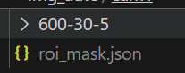

2. 删除后，输入操作指令如下，把dir后到--bc前的地址改为你对应的地址，之后回车运行：
```
python selector_zn.py --input_dir data/cattle/imgs/img_manual/cam4 --bc_threshold 1 --bm_threshold 0.85 --phash 1 --phash_threshold 8 
```
其中对应文字的意思：
```bash
--input_dir
   - 默认值："data/img_manual/CAM0"
   - 描述：要处理的输入目录。

--no_det
   - 默认值：是
   - 描述：是否使用无检测选择器。

--conf
   - 默认值：是
   - 描述：是否使用平均置信度选择器。

--conf_threshold
   - 默认值：2
   - 描述：平均置信度选择器的阈值。公式为 mean_conf - std_dev / x，阈值越大，则选择的帧越多。

--bc
   - 默认值：是
   - 描述：是否使用边界框数量选择器。

--bc_threshold
   - 默认值：1
   - 描述：边界框数量选择器的阈值。阈值越大，则选择的帧越少。

--bm
   - 默认值：是
   - 描述：是否使用二进制矩阵选择器。

--bm_threshold
   - 默认值：0.7
   - 描述：二进制矩阵选择器的阈值。阈值越大，则选择的帧越多。

--bm_save
   - 默认值：否
   - 描述：是否保存二进制矩阵为图像。

--phash
   - 默认值：是（前面操作过程中进行了操作）
   - 描述：是否启用 pHash 过滤。

--phash_threshold
   - 默认值：3
   - 描述：pHash 相似度阈值。

--img_size
   - 默认值："(1920, 1080)"
   - 描述：图像大小，格式为 'width x height'。

--delete
   - 默认值：否
   - 描述：是否删除未选择的帧。

--compress
   - 默认值：否
   - 描述：是否压缩图像文件夹为 zip 文件。
```
3. 运行的结果

运行后在manual/cam文件下会生成以下图表

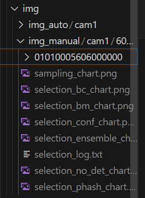

### 输出的这些图表，包括采样情况、平均置信度、无检测选择、边界框数量和二进制矩阵选择等。

###### Frame Sampling for Camera:

该图表显示了摄像头在特定日期的帧采样情况。以下是每个元素的含义：
- **X 轴（水平）**：帧索引，表示视频中的每一帧。
- **Y 轴（垂直）**：未给出具体含义，但可能代表采样状态的某种指标，例如成功率或采样密度。
- **蓝色垂直线**：代表采样的帧，即所有成功采样的帧。
- **橙色垂直线**：代表采样失败的帧，即无法成功采样的帧。
- **标题**：指示图表的主题，指定了进行帧采样的摄像头和日期。

###### Bounding Box Count Selection for Camera:
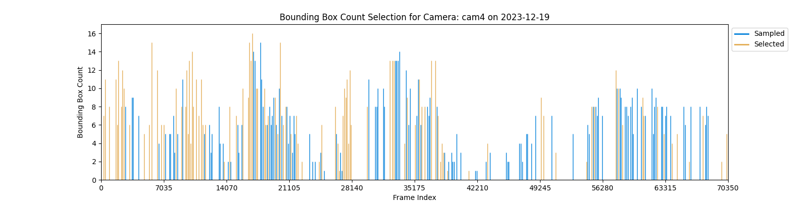
该图表显示了边界框数量选择器的结果。以下是每个元素的含义：
- **X 轴（水平）**：帧索引，表示视频中的每一帧。
- **Y 轴（垂直）**：表示每一帧中检测到的边界框数量。
- **蓝色垂直线**：代表采样帧，即所有考虑的帧。
- **橙色垂直线**：代表边界框数量选择器选择的帧，即根据边界框数量算法的选择结果。
- **标题**：指示图表的主题，指定了进行边界框数量选择的摄像头和日期。（图上面的那行小字，下面的标题同理）

###### Binary Matrix Selection for Camera:
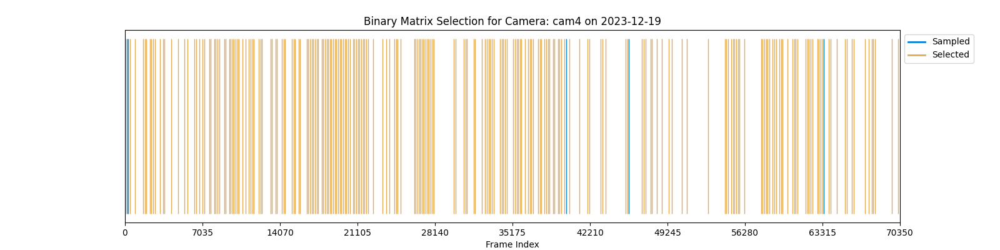
该图表显示了二进制矩阵选择器的结果。以下是每个元素的含义：
- **X 轴（水平）**：帧索引，表示视频中的每一帧。
- **Y 轴（垂直）**：范围从 0 到 1，但刻度未标记。此轴主要表示帧的选择状态，而不是具体的数值。
- **蓝色垂直线**：代表采样帧，即所有考虑的帧。
- **橙色垂直线**：代表二进制矩阵选择器选择的帧，即基于二进制矩阵算法的选择结果。
- **标题**：指示图表的主题，指定了进行二进制矩阵选择的摄像头和日期。

###### Confidence Selection for Camera:
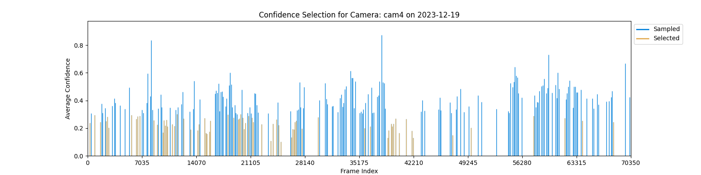
该图表显示了置信度选择器的结果。以下是每个元素的含义：
- **X 轴（水平）**：帧索引，表示视频中的每一帧。
- **Y 轴（垂直）**：平均置信度，表示视频中每一帧对象存在的置信度。
- **蓝色垂直线**：代表被考虑的帧，即所有采样的帧。
- **橙色垂直线**：代表置信度选择器选择的帧，即具有高置信度的帧。
- **标题**：指示图表的主题，指定了进行置信度选择的摄像头和日期。

###### No Detection Selection for Camera:
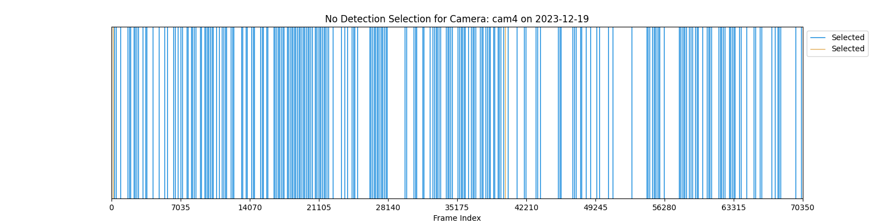
该图表显示了无检测选择器的结果。以下是每个元素的含义：
- **X 轴（水平）**：帧索引，表示视频中的每一帧。
- **Y 轴（垂直）**：在这个图表中没有实际的含义，只是为了展示选择结果。
- **蓝色垂直线**：代表被考虑的帧，即所有采样的帧。
- **橙色垂直线**：代表无检测选择器选择的帧，即视频中未检测到任何对象的帧。
- **标题**：指示图表的主题，指定了进行无检测选择的摄像头和日期

###### pHash Selection for Camera:
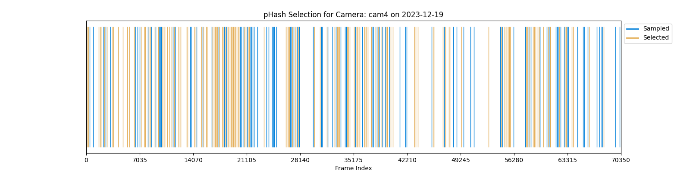
该图表展示了 pHash 选择器的结果。
- **X 轴（水平）**：帧索引，表示视频中的每一帧。
- **Y 轴（垂直）**：范围从 0 到 1，但刻度未标记。此轴主要表示帧的选择状态，而不是具体的数值。
- **蓝色垂直线**：代表采样帧，即所有考虑的帧。
- **橙色垂直线**：代表 pHash 选择器选择的帧，即在 pHash 过滤后保留的帧。
- **标题**：指示图表的主题，指定了进行 pHash 选择的摄像头和日期。

###### Ensemble Selection for Camera:
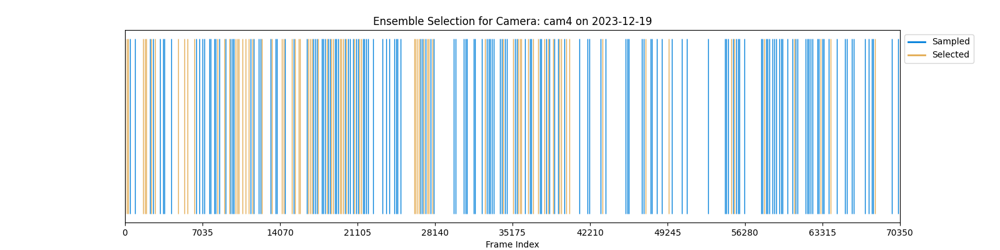
该图表显示了综合选择器的结果。以下是每个元素的含义：
- **X 轴（水平）**：帧索引，表示视频中的每一帧。
- **Y 轴（垂直）**：范围从 0 到 1，但刻度未标记。此轴主要表示帧的选择状态，而不是具体的数值。
- **蓝色垂直线**：代表采样帧，即所有考虑的帧。
- **橙色垂直线**：代表综合选择器选择的帧，即在所有选择器的结果综合后保留的帧。
- **标题**：指示图表的主题，指定了进行综合选择的摄像头和日期。

#### 同样弹出的日志文件，其中记录了刚才筛选操作的参数配置、帧索引等信息。
```
Camera: cam4, Date: 2023-12-19
Videos Duration: 78.18 minutes, FPS: 15
Sampling Rule: 10-1-1
ROI Filtering: True
PHash Filtering: True, PHash Threshold: 3
Total Frames: 70359, Failed Frames: 2
Sampled Frames: 234, Sampled Percentage: 0.33%

Confidence Selector: True, Mean Avg Confidence: 0.3646596342390176, Confidence Threshold: 2
Bounding Box Count Selector: True, Bounding Box Count Threshold: 1
Binary Matrix Selector: True, Binary Matrix Threshold: 0.85
No Detection Selection: 3
Confidence Selection: 71
Bounding Box Count Selection: 104
Binary Matrix Selection: 228
PHash Selection: 136
Ensemble Selection: 78


Sampled Frames Indices: [0, 150, 300, 450, 900, 1650, ...]

Failed Frames Indices: [64499, 64500]

Selected Frames Indices: {0, 38400,0, 15900, 13350, 19500, ...}
```
日志上对应提供了有关摄像头 cam4 在 2023 年 12 月 19 日的采样和选择过程的详细信息：

- **视频信息：** 视频时长为 78.18 分钟，帧率为 15 帧/秒。
- **采样规则：** 采用了 10-1-1 的采样规则。
- **ROI 过滤：** 启用了 ROI 过滤，用于在采样过程中筛选感兴趣的区域。
- **PHash 过滤：** 启用了 PHash 过滤，使用了阈值为 3 的 PHash 进行帧之间的相似性筛选。
- **帧数信息：** 总共有 70359 帧，其中有 2 帧失败。
- **采样信息：** 采样了 234 帧，采样率为 0.33%。
- **选择器信息：** 使用了置信度选择器、边界框数量选择器和二进制矩阵选择器，它们分别使用了特定的阈值来筛选帧。
- **选择结果：** 分别有置信度选择、边界框数量选择、二进制矩阵选择、PHash 选择和集成选择，选择了相应数量的帧。
- **帧索引信息：** 给出了采样的帧索引、失败的帧索引以及选中的帧索引。


# 各生成的结果都可以直接在文件夹上右键下载存储


