# 服务器连接
## 想要远程连接服务器，我们自己的电脑需要有对应操作的软件和能够让服务器与我们互相验证的密码。

下载安装电脑对应所需要的软件
1. 电脑软件下载
    1. 建议下载vscode软件，这个软件可以在其中直接下载各种插件，比较方便。下面以VScode为例，讲解会使用到的插件内容等。
    （在百度上搜索vscode，根据自己电脑配置选择版本下载安装）

    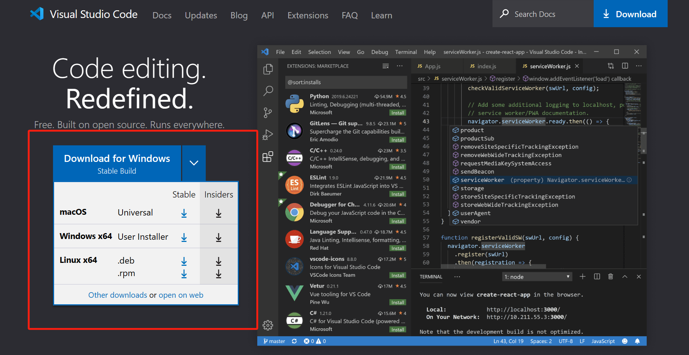

    2. 打开vscode，点击左边插件选项，搜索python，remote explorer，remote-ssh 三个插件，下载安装。
    （remote explorer是远程连接插件，remote-ssh是远程识别密钥的插件）

    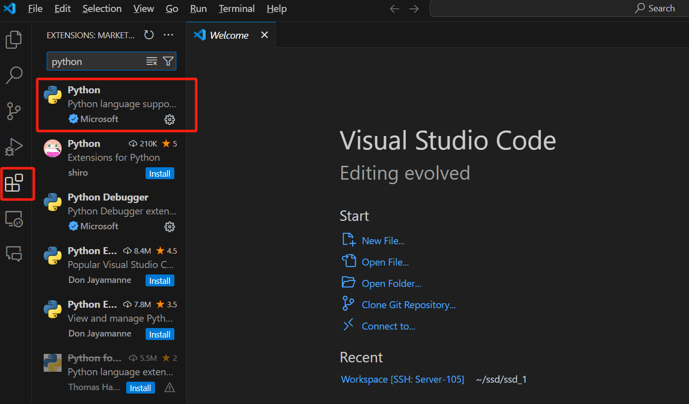
    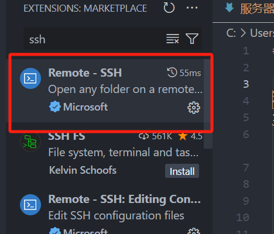
    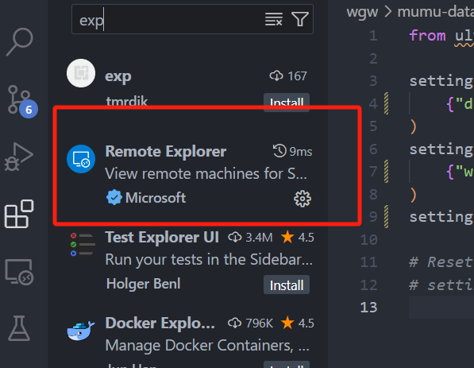

3. 公钥配置：

    1. 首先需要配置下本地公钥（即在本地电脑中创造可进行识别的公共钥匙，复制后存在服务器中，这样服务器就能和我们的电脑相互进行识别）

        配置公钥操作:（配置过的可跳过这一步）
        1. 打开命令提示符（Windows电脑按住win+r，输入cmd）
        2. 在>后输入ssh-keygen回车，会让选择存储的位置，可更改，更改后回车生成。

       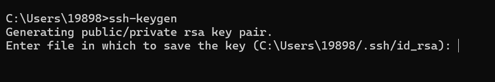

    2. 在设置的文件夹内找到id_rsa.pub文件，用txt或者doc，均可打开，复制其中内容，发送给管理人员等待连接。（复制的代码就是本地电脑的公钥内容）

     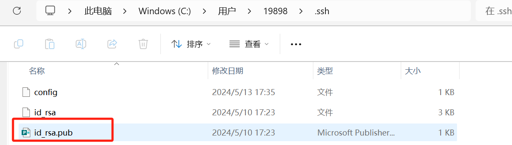
   
3.管理人员操作粘贴密钥到服务器中

    1. 进入服务器，并在终端输入```/.ssh/authorized_keys```，在新界面，按顺序粘上新的ssh
    2. 设置禁⽌服务器密码登陆
       ```sudo vim /etc/ssh/sshd_config: #sudo是以管理员身份操作的意思，后面是路径
            PermitRootLogin no
            PasswordAuthentication no   #这里改成no就是不要密码了
            ChallengeResponseAuthentication no  #这是免去回应
            PubkeyAuthentication yes

            sudo systemctl restart sshd  
            sudo service ssh restart  #这两个是重启命令，重启系统和服务器```


4. 在服务器上安装mumu软件：

    1. 在连接到服务器后，通过remote explorer连接服务器

       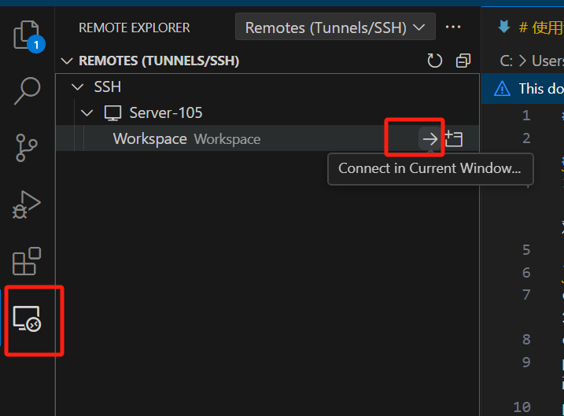 

    2. 把下载解压的mumu-data-engine文件夹上传你的文件夹内 （可通过`scp`指令操作）

      （`scp -r 文件所在目标 star@sever-105`）(star@sever-105为服务器位置)（服务器内地址可以如下图复制）

   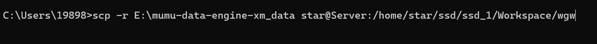
   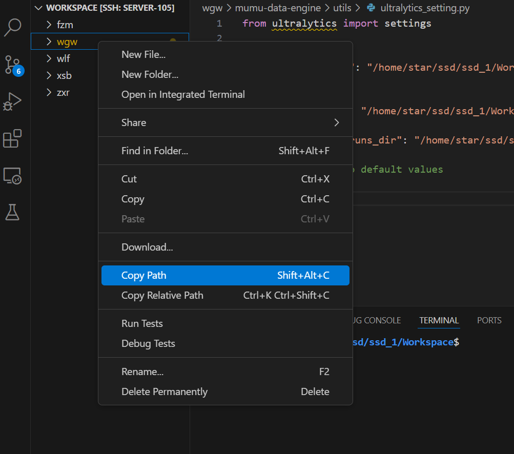

## 文件的上传和下载
1. 上传：

    1. 若只有单一视频可直接拖拽到文件内

   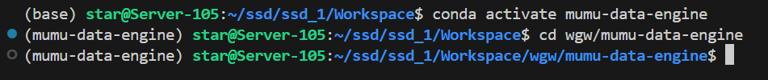

    2. 若多文件可直接用代码上传到服务器指定路径中。

    （键入指令`scp -r 文件所在目标 star@sever-105`）(star@sever-105为服务器位置)（出现图中情况即传输完成）
   
   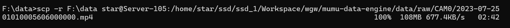

3. 下载

    1. 处理后的图片，可右键对应文件夹下载

    2. 同样也可以`scp`用指令，调换位置即可。（空格不要忘）(star@sever-105为服务器位置)
       
       ```scp -r star@sever-105：服务器内文件位置 文件所在目标```
   


